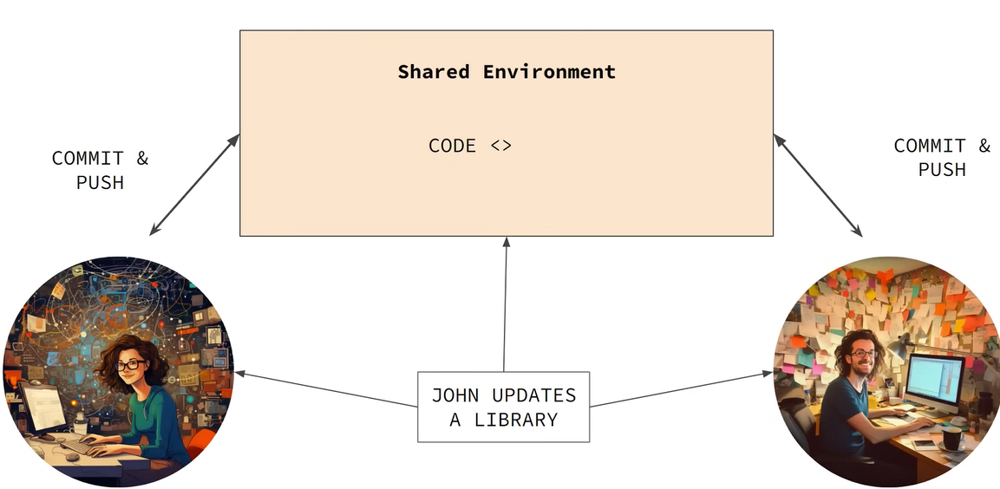

# Java Spring-Boot Project: Job Application

# Project Structure:


# Resquest mapping @annotation in springboot...

### *Request mapping is an @annotation that is provided to us and it can used  at method level as well as class level.  

## At method level we have different methods like...  

1. @GetMapping
2. @PostMapping
3. @PutMapping
4. @DeleteMapping
5. @PatchMapping

## At class level we have different methods like...  

#### *class level: it used to set a base URL for a perticular controller like my JobController.

1. @RestController
2. @RequestMapping : means when it's applied at class level it sets a base URL path for all the   methods that are handeling request in that particular controller. [exmaple: @ResquestMapping("/jobs")]


# List of end-points and API urls...  

### All the end-points I will be building...

* GET / jobs -> List of jobs
* GET /jobs/{id} -> get specific job by ID
* POST/ jobs -> Create a new job (request body should contain the job details)
* DELETE /jobs/{id} -> Delete a specific job by ID
* PUT /jobs/{id} -> Update a specific job by ID (request body should contain the updated job details)

  

### Examples API URLs...

* GET {base url}/ jobs
* GET {base url}/ jobs/1
* POST {base url}/ jobs
* DELETE {base url}/ jobs/1
* PUT {base url}/ jobs/1


# 23-10-2024 ==> Today's Task...

we have define an endpoints which gives us the list of jobs that exist in our application.  
Job --> JobController --> Job
1. GET / jobs -> List of jobs [GET {base url}/ jobs] --> Created

# 24-10-2024 ==> Today's Task...  

1. POST/ jobs -> Create a new job (request body should contain the job details) [POST {base url}/ jobs] --> created  
using JSONlint create job details..  
{  
    "id": 1,  
    "title": "Software Engineer 1",  
    "description": "Test Description",  
    "minSalary": "30000",  
    "maxSalary": "45000",  
    "location": "Gurgoan"  
}  

2. Created job_service interface for loss coupling.  
Because, have some modularity in my code-base, so I can separate the interface and the implementation. for that I created Implementation package and job_service_impl class.  


```3. * Problem_1: When I created a Job without [job_id] it take  the parameter null in job, without a job_id it need to show output error or anything else....??```

```* Solution:  ``` 
```1. Create a class variable called [nextId].  ```

```2. This variable which used to keep track of job_id that I have in my application. And, it will do is, set current id to job object then it will increment by 1.```
```3. Also, this will help with no duplicate job_id in my job[every I create new job, job_id will be unique].```


# 25-10-2024 ===> Today's Task...

1. GET /jobs/{id} -> get specific job by ID [GET {base url}/ jobs/1]---> created

use @PathVariable annotation which is used to extract the value from the URL.

Response entity: Response entity is class in spring and it's a wrapper that represent the entire HTTP response.


//Get specific job by ID using ResponseEntity for batter readability and HTTP response.  
    @GetMapping("/jobsById/{id}")  
    public ResponseEntity<Job> getJobById(@PathVariable Long id) {  
        Job job = jobservice.getJobById(id);  
        if (job != null){  
            return new ResponseEntity<>(job, HttpStatus.OK);  
        }  
        return new ResponseEntity<>(HttpStatus.NOT_FOUND);  
    }  


# 26-10-2024 ==> Today's Task...  

1. DELETE /jobs/{id} -> Delete a specific job by ID [DELETE {base url}/ jobs/1] --> Created 

2. PUT /jobs/{id} -> Update a specific job by ID [PUT {base url}/ jobs/1] --> Created


# 27-10-2024 ==> Today's Task...

## what is JPA?
    
    I have a Job class...  

    
    public class Job {
    private Long id; 
    private String company;
    private String title;
    private String description;
    private String minSalary;
    private String maxSalary;
    private String location;
    }
    

    Now I need to store the job class into a database. How I do this??  
##    Using JPA [Java Persistence API]  

    It allows us to convert object into relational table.  
  

## Advantages of using JPA
    -> Easy and Simple.
    -> Makes writting query easier
    -> Allows us to save and update objects without using DML language at all.
    -> Easy integration with Spring-Boot.

## Enabling JPA by adding application properties...
        Spring.h2.console.enabled = true
        Spring.datasource.url = jdbc:h2:mem:test
    

# H2 database [using in my project]

## About:
    -> It's a Open Source relational database written in Java and it's fast for java based applications.
    -> It's an SQL database based on java.
    -> It has Embaded mode [means, runs same JVM within same application] while Server mode [means, it has running on it's own, it has accept connections from the clients over the network]

```Done with Job_Controller, Job_Service, Job_Repository.```

# 28-10-2024 ==> Today's Task...

``` Start With Companies```


1. GET /companies -> get all the companies --> created
2. PUT /companies/{id} -> update a specific company by ID
3. POST /companies -> create a new company  

# 29-10-2024 ==> Today's Task...

1. DELETE /companies/{id} -> delete a specific company by ID

# 30-10-2024 ==> Today's Task...

1. GET /companies/{id} -> get a specific company by ID

## Diwali 🎆🎇

# 5-11-2024 ==> Today's Task...

``` Start With Reviews ```


# 6-11-2024 ==> Today's Task...

1. GET /companies/{companyId}/reviews 
2. POST /companies/{companyId}/createReviews

# 7-11-2024 ==> Today's Task...

1. ``` *Challenge-2: How the review is manage if the compnay doesn't exit? ```  
``` To handel the make [addReview] return type boolean (ReviewService.java)```

2. GET /companies/{companyId}/reviews/{reviewsId}  --> get a specific review for a specific company  

# 8-11-2024 ==> Today's Task...

1. PUT /companies/{companyId}/reviews/{reviewsId} --> to update a particular review
2. DELETE /companies/{companyId}/reviews/{reviewId}

# 9-11-2025 == Today's Task...

## Spring-Boot Actuators


### besically it's an interface or a tool by using this we can monitor our application.
### It's gives us insight about running application as to what is happening with it.


## Actuators endpoints


# 11-11-2024 ==> Today's Task...

## Docker With SpringBoot




``` Containerization: It's a lightweight virtualization technology that enable us to package an application along with it's dependencies   into a standard unit which is called a container. ```  
``` With docker I can create containers that have everything that is needed for an application to run this can includes  the code, the runtime, the libraries, even the system tools. ```  
``` This containers are portable means we can move them accross the system and can be deployed on any system that has docker running. ```  


## Docker Architecture


## Docker CLI: 
    Command Line interface it's a clinents that allows users to interact with docker.  
    Docker CLI interact with Docker Deamon to get those commnand exicuted.  
## Docker Deamon:
    It's runs on host os, resposible for building docker images, and managing docker containers.  
    Interact with docker-API and it manages all docker images.  
## Docker images:
    These are tamplates with instructions for creating something called as Docker Container.  
    Blueprint for creating a container.  

## Docker Registry:
    It is a service that stores docker images, which can be public and private.
## Docker Engine:
    This is the runtime that manages the containers and it provides all the neccessary tools 
    that we will need to build, run, manage docker container.
## Dockerfile:
    It's a file that contains instructions to build a docker image.

# Containerizing My SpringBoot Application

## Example Files
    FROM openjdk:11 // use official openjdk-11 image from dockerhub
    VOLUME /temp // create a mount point with the specific path and it marks it as holding externally mounted volumes. creating volume with name temp.
    ADD target/my-app.jar my-app.jar // add the jar file of application from target directory to docker image and naming it my-app.jar
    EXPOSE 8080 // EXPOSE 8080 port to the host machine which will allow us to access this application from our system.
    ENTRYPOINT ["java","-jar","/my-app.jar"] // It tells the docker what command to run when the container start.

## ``` With SpringBoot we don't need to define a docker file  ```  
    Because we use [Maven plug-in] from pom.xml file
    
    <build>
		<plugins>
			<plugin>
				<groupId>org.springframework.boot</groupId>
				<artifactId>spring-boot-maven-plugin</artifactId>
			</plugin>
		</plugins>
	</build>
    Docker autometically knows and understand with the help of this plug-in as what all needs to be included,
    into the image for this application to be dockerize that is based on all the dependencies present in pom.xml file.
    that's the benifit of using springboot with docker.

## ``` How does process work? ```
    1. Spring Boot internally uses [Cloud Native Buildpacks] to create a docker image without the need of a dockerfile.
    2. SpringBoot Maven plugin
    3. Layering

### Cloud Native Buildpacks:
    specification created by cloud nating computing foundation(CNCF) which is design to create container image from the Source code
    without a need of dockerfile.

## ``` Command for containerizing ```
    ./mvnw spring-boot:build-image "-Dspring-boot.build-image.imageName=<docker-hub profile name/imagename>"
##
    ./mvnw: about Maven wrapper 
    spring-boot:build-image: which is the Maven goal that is build the docker image from the application using cloud Native Buildpacks
    -Dspring-boot.build-image.imageName=<IMAGE-NAME>: Java System property that is being passed to springboot
    build image goal
    
## So there will be a few problem when we containerize our application if our sdk version and Maven version not matched.
    [ERROR] Failed to execute goal org.springframework.boot:spring-boot-maven-plugin:3.3.4:build-image (default-cli) on project JobApplication: Execution default-cli of goal org.springframework.boot:spring-boot-maven-plugin:3.3.4:build-image failed: Builder lifecycle 'creator' failed with status code 51 -> [Help 1]

### ``` How to solve this problem? ```

    <plugins>
			<plugin>
				<groupId>org.springframework.boot</groupId>
				<artifactId>spring-boot-maven-plugin</artifactId>
				<configuration>
					<image>
						<env>
							<BP_JVM_VERSION>${java.version}</BP_JVM_VERSION>
						</env>
					</image>
				</configuration>
			</plugin>
	</plugins>

    use this configuration [stackoverflow answer]

    <configuration>
		<image>
			<env>
				<BP_JVM_VERSION>${java.version}</BP_JVM_VERSION>
			</env>
		</image>
	</configuration>

## Push docker image to docker hub
    Command:
    Syntax: docker push <profile_name/image_name>
            docker push popeyehk404/jobfindimage

# Docker Commands
    1. --> docker pull <image_name> //used to pull docker image from docker hub/repository
    
    2. --> docker push <profile_name/image_name> //used to push the docker image to docker hub
    
    3. --> docker run -it -d -p <host-port>:<container-port> --name <username><image_name> //[it = interactive, d = detach mode, p = port mapping] used to run docker container from the image
    
    4. --> docker stop <container-id/container-name> //used to stop running container
    
    5. --> docker start <container-id/container-name> //used to start container
    
    6. --> docker rm <container-id/container-name> //used to remove stopped/delete container 
    
    7. --> docker rmi <image-id/image-name> //used to remove a image from local storage
    
    8. --> docker ps //used to get running container info
    
    9. --> docker ps -a //used to show all the containers which are running as well as stopped
    
    10. --> docker images //used to list all images on host
    
    11. --> docker exec -it <container-name/container-id> bash //used to access a  running container
    
    12. --> docker build -t <username/image-name> . //used build an image from dockerfile
    
    13. --> docker logs <container-id/container-name> //used to get the logs of a particular container that is running
    
    14. --> docker inspect <container-id/container-name> //used to get details info of a particular container

# ``` PostgreSQL ```

## ```What is PostgreSQL?```

### ``` Why I use it over H2 ```
    H2 is very capable database and has advantage of being embadded in JAVA.
    However when it comes to build large application PostgraSQL has lots of advantages.
#### ```Advantages ```
    1. Scalability: It really scalable and it enables us to work with high
                    volumn of data and support lots of concurrent users.
    
    2. Feature Set: PostgraSQL has high feature sets as compare to H2 and it
                    supports SQL standard data types and functions
    
    3. Ecosystem and Tools: PostgraSQL has vary broad ecosystem, wide range 
                            of GUI tools like graphical user interface, libraries, third party support, community support etc.
    
    4. Durability: Best choice production grad invironments deu to its
                   durability while H2 is the best choice for development and testing purpose 

### PostgreSQL Database configuration setting so work with PostgreSQL
    spring.datasource.url=jdbc:postgresql://localhost:5432//jobapp
    spring.datasource.username=root
    spring.datasource.password=root1234
    spring.jpa.database=POSTGRESQL
    spring.jpa.show-sql=true
    spring.jpa.hibernate.ddl-auto=create-drop
    spring.jpa.database-platform=org.hibernate.dialect.PostgreSQLDialect

    jdbc:postgresql: means using PostgreSQL database
    localhost:5432: running on localhost at 5432 port which default for PostgreSQL
    jobapp: Database name